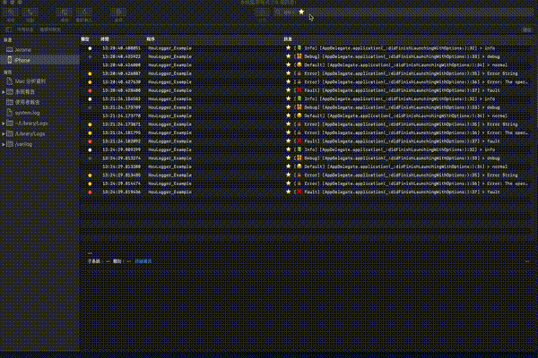

# HouLogger

[](https://travis-ci.org/jerome.developer.tw@gmail.com/HouLogger)
[](https://cocoapods.org/pods/HouLogger)
[](https://cocoapods.org/pods/HouLogger)
[](https://cocoapods.org/pods/HouLogger)

HouLogger is a pretty, pure-Swift library for logging and saving log file in local disk. It provides you a chance to check log in Console APP.

## Features

- [x] Log pretty.
- [x] Save log in local disk.
- [x] Show log on UIWindow.
- [x] Record user APP version.
- [x] Record user updated APP version History. e.g 1.0 -> 1.1 -> 1.5
- [x] Record user device infomation.

## Start with HouLogger

### Two import classes
1. BaseLogger: Just Log
1. AdvancedLogger: Sub class of BaseLogger. And it provides the ability to save log in files and show log on UIWindow and UIView
1. LogTextView: Show Log UIView.

```swift
// configure in `application(_ application: UIApplication, didFinishLaunchingWithOptions launchOptions: [UIApplicationLaunchOptionsKey: Any]?) -> Bool`
    UserDefaults.standard.setAPPVersionAndHistory() // NOTE: Do not forget this line.
    logger.configure([.debug, .fault, .error, .info, .normal])

// Usage
    logI("info")
    logD("debug")
    logN("normal")
    logE("Error String", theOSLog: .network)
    logE(APIError.invalidURL, theOSLog: .network)
    logF("fault", theOSLog: .test)
```

Print
```
2019-11-06 10:55:11.836198+0800 HouLogger_Example[28550:8108832] [default] ⭐️ [📗 Info] [AppDelegate.application(_:didFinishLaunchingWithOptions:):32] > info
2019-11-06 10:55:11.864916+0800 HouLogger_Example[28550:8108832] [default] ⭐️ [👨‍👩‍👧‍👦 Debug] [AppDelegate.application(_:didFinishLaunchingWithOptions:):33] > debug
2019-11-06 10:55:11.867688+0800 HouLogger_Example[28550:8108832] [default] ⭐️ [😂 Default] [AppDelegate.application(_:didFinishLaunchingWithOptions:):34] > normal
2019-11-06 10:55:11.869831+0800 HouLogger_Example[28550:8108832] [network] ⭐️ [💩 Error] [AppDelegate.application(_:didFinishLaunchingWithOptions:):35] > Error String
2019-11-06 10:55:11.874609+0800 HouLogger_Example[28550:8108832] [network] ⭐️ [💩 Error] [AppDelegate.application(_:didFinishLaunchingWithOptions:):36] > Error: The operation couldn’t be completed. (HouLogger_Example.AppDelegate.APIError error 0.)
2019-11-06 10:55:11.877281+0800 HouLogger_Example[28550:8108832] [test] ⭐️ [❌ Fault] [AppDelegate.application(_:didFinishLaunchingWithOptions:):37] > fault
```
### A More Advanced Example
#### Show Log Text View and save log file in cache directory
```swift
logger.configure([.debug, .fault, .error, .info, .normal], shouldShow: true, shouldCache: true)
```

Add LogTextView in your UIWindow/UIView
E.g
```swift
if #available(iOS 11.0, *) {
      window.addSubview(logTextView, constraints: [
        UIView.anchorConstraintEqual(from: \UIView.topAnchor, to: \UIView.safeAreaLayoutGuide.topAnchor, constant: .defaultMargin),
        UIView.anchorConstraintEqual(from: \UIView.leadingAnchor, to: \UIView.safeAreaLayoutGuide.leadingAnchor, constant: .defaultMargin),
        UIView.anchorConstraintEqual(from: \UIView.bottomAnchor, to: \UIView.safeAreaLayoutGuide.bottomAnchor, constant: CGFloat.defaultMargin.negativeValue),
        UIView.anchorConstraintEqual(from: \UIView.trailingAnchor, to: \UIView.safeAreaLayoutGuide.trailingAnchor, constant: CGFloat.defaultMargin.negativeValue),
      ])
    } else {
      window.addSubview(logTextView, constraints: [
        UIView.anchorConstraintEqual(with: \UIView.topAnchor, constant: .defaultMargin),
        UIView.anchorConstraintEqual(with: \UIView.leadingAnchor, constant: .defaultMargin),
        UIView.anchorConstraintEqual(with: \UIView.bottomAnchor, constant: CGFloat.defaultMargin.negativeValue),
        UIView.anchorConstraintEqual(with: \UIView.trailingAnchor, constant: CGFloat.defaultMargin.negativeValue),
      ])
    }
  }
```
#### Add custom JeOSLog
You can add new case in JeOSLog enum in BaseLogger.swift file.

##### Use HouLogger with Console APP


## Requirements

- iOS 10.0+
- Swift 4.0+

## Installation

HouLogger is available through [CocoaPods](https://cocoapods.org). To install
it, simply add the following line to your Podfile:

```ruby
pod 'HouLogger'
```

## Author

jerome.developer.tw@gmail.com

## License

HouLogger is available under the MIT license. See the LICENSE file for more info.
